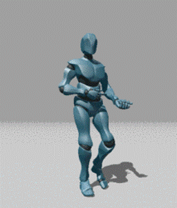
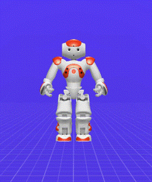

# NaoFBXControl

## 项目简介

本项目以 Nao 机器人为平台，根据人体动捕数据来控制仿人机器人模拟人体运动。

项目的输入文件为包含人体数据的 FBX 文件（来自 www.mixamo.com ），项目的输出文件为 behavior.xar 文件，此可以通过 Nao 机器人配套的仿真平台 choregraph 打开，控制 Nao 机器人运动。

本项目最终的运行结果如下所示（ GIF 动图）：

## 环境配置

Python 版本：3.7.7（注：这里 python 的版本必须是 3.7，因为下文中 FBX Python SDK 库的一个依赖文件为 Pytho37.dll，FBX Python SDK 在3.8 版本的 Python 环境中无法使用）

FBX Python SDK：2020.2

Nao 机器人模拟平台 Choregraphe ：2.1.4

Input：FBX文件（存储于 BinaryFBX文件夹中，更多 FBX 资源可从 www.mixamo.com 中下载，FBX文件可使用 MotionBuilder 软件查看）

## 程序思路

本程序通过 FBX SDK 读取存储于 FBX 文件中的人体动作捕捉数据，并据此进行逆运动学求解，结合 Nao机器人本身的运动特点，求解出适用于 Nao 机器人各自由度的旋转角度，使其在此角度下模仿人体动作；当 Nao 机器人成功模拟人体运动后，我们需要一个指标来表示模拟的准确度：通过正运动学求解得到 Nao 机器人模型（./nao.fbx）在各自由度旋转相应角度后的位姿，然后计算 Nao 机器人模型与人体模型代表同一肢体部位的单位向量的夹角值，以此表示模拟的准确度。

正逆运动学为机器人运动学的内容，具体可参考B站台大林沛群老师的机器人运动学的课程；

本程序逆运动学主要采用较简单的几何法，主要根据各自由度的运动方向及人体 FBX 模型中的关节点分布来计算各自由度的旋转角度，计算出来后，还要根据 Nao 机器人与 FBX 模型的起始角度、旋转阈值、角度正负与增减方向等各方面（具体可见官方文档）的差异，对各自由度初步计算出来的旋转角度进行角度映射，最终得到适用于 Nao 机器人本身的旋转角度。

本程序正运动学部分，并未对 Nao 机器人建立复杂的运动学模型，而是根据其肢体数据（具体可见官方文档）为其建立了 FBX 模型，通过 FBX SDK 为 Nao 机器人各自由度输入旋转角度，再通过 FBX SDK 获取旋转之后的位姿，通过这种方法，将复杂的正运动学计算交给了 FBX 来进行。

在同一时刻/帧（即给 Nao 机器人模型输入人体模型对应时刻下的旋转角度），计算 Nao 机器人模型和人体模型的同一肢体部位（本程序以人体的右大臂和右小臂为例）的单位向量的夹角，以此表示模拟的准确度。